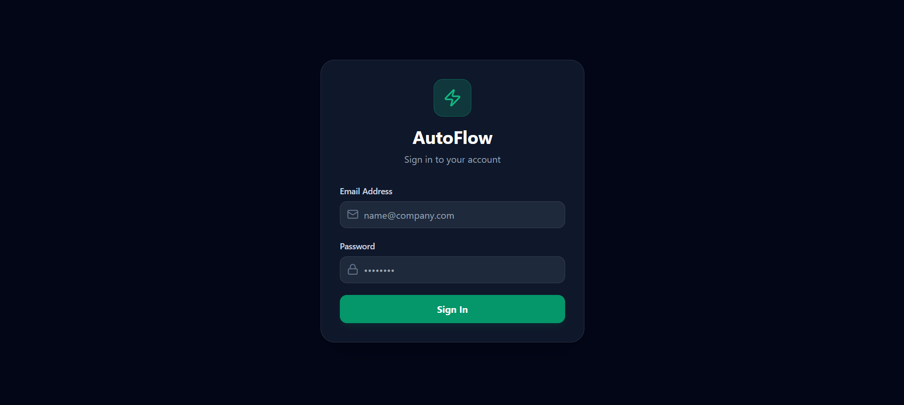
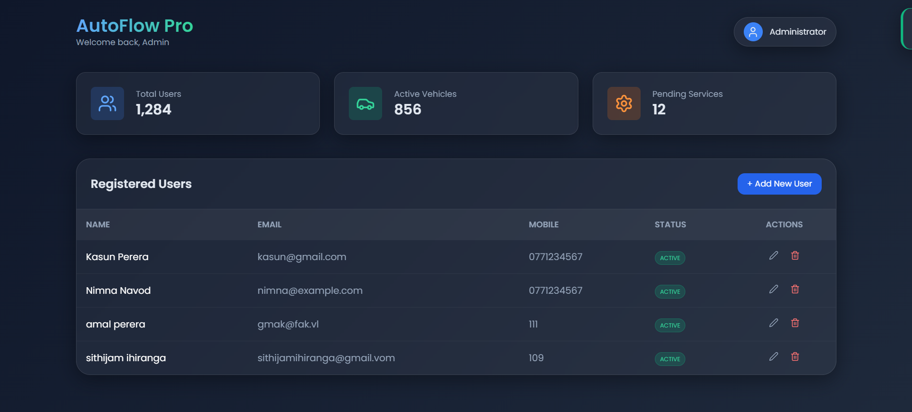

---

# AutoFlow | Full-Stack User Management System

AutoFlow is a modern, responsive User Management System built with a **Spring Boot** backend and a **PHP/JavaScript** frontend. It features a sleek dark-themed interface, secure CRUD operations, and soft-delete functionality.

---

## 📸 Interface Preview

### 🔐 Secure Authentication
The login system ensures only authorized users can access the dashboard, featuring a clean, glassmorphic UI.
<br>


### 📊 Administrative Dashboard
A comprehensive view of all active users with real-time management capabilities.
<br>


### 🔐 Secure Authentication

The login system ensures only authorized users can access the dashboard, featuring a clean, glassmorphic UI.

### 📊 Administrative Dashboard

A comprehensive view of all active users with real-time management capabilities.

---

## ✨ Core Features

* **Full CRUD Integration:** Create, Read, Update, and Soft-Delete users seamlessly.
* **Soft Delete Logic:** Ensures data integrity by marking users as inactive rather than removing records from the database.
* **RESTful API:** Powered by Spring Boot for high performance and scalability.
* **Modern UI/UX:** Built with Tailwind CSS, Lucide Icons, and custom interactive modals.
* **CORS Handling:** Pre-configured cross-origin resource sharing for secure frontend-backend communication.

## 🛠️ Technology Stack

* **Frontend:** PHP (Routing), JavaScript (Fetch API/ES6), Tailwind CSS.
* **Backend:** Java 17+, Spring Boot, Spring Data JPA.
* **Database:** MySQL.

---

## 📂 Project Structure

```text
autoflow/
├── backend/                # Spring Boot Application (Java)
├── frontend/               # PHP & JavaScript Files (UI)
├── screenshots/            # UI Images (login.png, dashboard.png)
├── autoflow.sql            # Database Schema & Sample Data
└── README.md               # Project Documentation

```

---

## ⚙️ Installation & Setup

### 1. Database Setup

1. Import the `autoflow.sql` file into your MySQL database server.

### 2. Backend Setup (Java Spring Boot)

1. Navigate to the `backend` folder.
2. Configure your database credentials in `src/main/resources/application.properties`.
3. Run the application using your IDE or:
```bash
mvn spring-boot:run

```


### 3. Frontend Setup (PHP)

1. Move the `frontend` folder content into your local server directory (e.g., `htdocs` or `www`).
2. Open the project in your browser via `http://localhost/autoflow`.

---

## 🛡️ API Endpoints

| Method | Endpoint | Function |
| --- | --- | --- |
| `POST` | `/api/users/login` | User Authentication |
| `GET` | `/api/users/all` | Fetch All Active Users |
| `POST` | `/api/users/register` | Register New User |
| `PUT` | `/api/users/update/{id}` | Update User Details |
| `PUT` | `/api/users/delete/{id}` | Soft Delete (Set Status = 1) |

---
